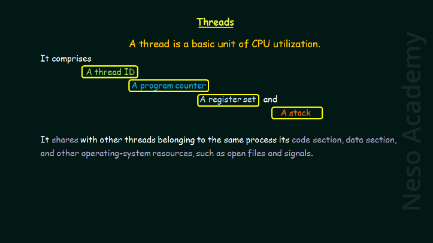
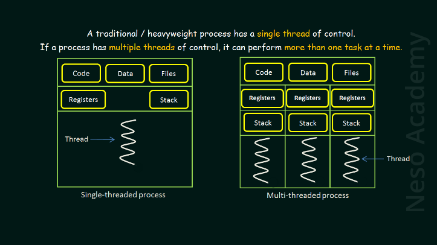
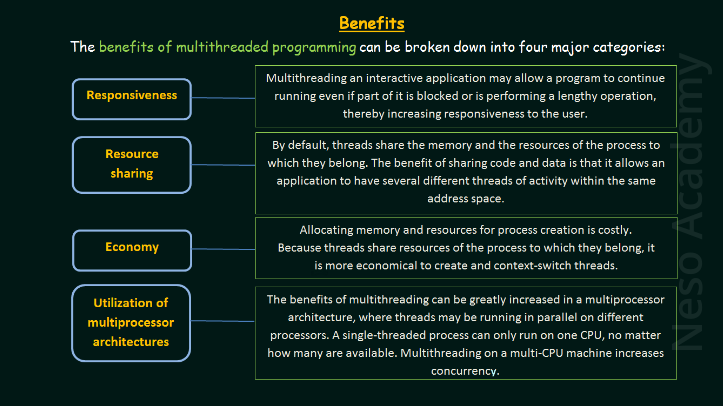

# Notes

## Escopo

### O que faz quando:
- Comem: Usando a **thread**
- Pensam: Em espera (não faz nada)
- Dormem: sleep()

*O que é fork?*  --> **mutex**

### Fluxo do projeto
**pensar->comer->dormir->pensar**
1. Todos os **philos** começam a pensar
2. Se estão a pensar podem **comer**

## The dining Philosophers
### Scenario:
- A philosophers needs both fork on his left and right hand to eat, else, he can't.

### Problems:
- **Deadlock** (impasse) - each of the philosophers pick up a fork, no one can eat, hence, a deadlock.\
O deadlock é uma situação indesejada em sistemas concorrentes em que duas ou mais threads (ou processos) ficam bloqueadas, aguardando uns aos outros para liberar recursos. Isso cria uma condição de impasse, onde nenhum dos threads pode prosseguir, resultando na paralisação do sistema. O deadlock geralmente envolve a competição por recursos finitos, como mutexes, semáforos ou recursos compartilhados.

Os deadlocks ocorrem quando quatro condições necessárias estão presentes simultaneamente. Essas condições são conhecidas como as quatro condições de Coffman, que são:

1. **Mutual Exclusion (Exclusão Mútua):** Pelo menos um recurso deve ser mantido em um estado exclusivo, o que significa que apenas um thread pode acessá-lo por vez.

2. **Hold and Wait (Aguardar e Manter):** Um thread que já possui recursos pode solicitar novos recursos sem liberar os que já possui.

3. **No Preemption (Não Preempção):** Recursos não podem ser retirados à força de um thread; eles só podem ser liberados voluntariamente.

4. **Circular Wait (Aguardar Circular):** Existe um conjunto de threads, cada uma delas está aguardando um recurso detido por outra thread no conjunto.

Quando essas quatro condições são satisfeitas simultaneamente, um deadlock pode ocorrer. Aqui está um exemplo simplificado de como um deadlock pode ocorrer:

1. Thread A adquire o recurso X.
2. Thread B adquire o recurso Y.
3. Thread A agora precisa do recurso Y, que é mantido por Thread B.
4. Thread B agora precisa do recurso X, que é mantido por Thread A.

Neste ponto, ambos os threads estão aguardando que o outro libere o recurso que precisa, criando um ciclo de espera circular, o que é a condição para o deadlock.

Prevenir deadlocks geralmente envolve estratégias como a ordenação de recursos, evitando aguardar por recursos enquanto mantém outros, usando técnicas de exclusão mútua eficientes, entre outras abordagens de design de software e sistemas concorrentes. O entendimento das condições de deadlock e a aplicação de boas práticas de programação e design de sistemas são essenciais para minimizar a ocorrência de deadlocks.
- **Starvation** (inanição - a fome)\
if a philosofer is not able to eat for a long period of time, the said philosopher may die of starvation.

### Possible Solutions
#### 1. Resource Hierarchy Solution (by Dijkstra)
O projeto "philosophers" da escola 42 é um exercício comum em cursos de sistemas operacionais e programação concorrente, projetado para ensinar aos alunos os conceitos de concorrência, threads, exclusão mútua e prevenção de deadlocks. O objetivo principal é simular o problema clássico dos "jantar dos filósofos" usando programação concorrente.

A resolução desse problema envolve a aplicação de uma hierarquia de recursos e a prevenção de deadlocks, conforme proposto por Dijkstra. O problema dos filósofos jantando é um exemplo clássico de um problema de sincronização concorrente, onde filósofos sentam-se à mesa para jantar e, entre cada par de filósofos, há um garfo. Os filósofos devem pegar dois garfos adjacentes para comer.

A hierarquia de recursos proposta por Dijkstra para prevenir deadlocks consiste em definir uma ordem hierárquica pela qual os recursos (garfos, no caso) podem ser adquiridos. Neste caso, os filósofos devem seguir uma ordem específica para pegar os garfos, evitando a criação de um ciclo que possa levar a um deadlock.

A abordagem geral para resolver esse problema é:

1. Cada garfo é associado a um filósofo, e cada garfo é representado por um semáforo ou uma variável de condição que controla o acesso a ele.

2. Os filósofos seguem uma ordem para pegar os garfos, evitando pegar ambos os garfos simultaneamente. Por exemplo, o filósofo 1 pega o garfo à esquerda e, em seguida, o garfo à direita, enquanto o filósofo 2 faz o oposto.

3. Quando um filósofo tenta pegar um garfo que não está disponível (ou seja, já está sendo usado por outro filósofo), ele aguarda até que o garfo esteja disponível.

4. A implementação deve incluir mecanismos de exclusão mútua, como mutexes ou semáforos, para garantir que apenas um filósofo possa pegar um garfo de cada vez.

5. O programa deve ser projetado de forma a permitir que os filósofos liberem os garfos após comer, para que outros filósofos possam usá-los.

A hierarquia de recursos é aplicada estabelecendo uma ordem para pegar os garfos que evite ciclos de espera circular. Essa abordagem previne eficazmente deadlocks, garantindo que os filósofos sigam uma ordem específica para pegar os garfos e que não fiquem presos em um estado de espera indefinida.

A implementação detalhada pode variar dependendo da linguagem de programação, da biblioteca de concorrência utilizada e dos recursos disponíveis, mas a ideia geral é seguir os princípios da hierarquia de recursos de Dijkstra para evitar deadlocks no problema dos filósofos jantando.
#### 2. Arbitrator Solution
#### 3. Chandy/Misra Solution

## Threads

***A thread is a basic unit of CPU utilization***\
(*Um thread é uma unidade básica de utilização da CPU*)

## CodeVault

### 1. Short introduction to threads (pthreads)

*For compile: `cc -g -pthread file.c -o file`*

```c
// Includes
#include <stdlib.h>
#include <stdio.h>
#include <unistd.h>
#include <pthread.h> // for use threads
```

```c
void* routine() {
    printf("Hello from threads\n");
    sleep(3);
    printf("Ending thread\n");
}

int main(int argc, char* argv[]) {  
    pthread_t p1, p2; // Create a variable type thread_t, this take a pointer 
    if (pthread_create(&p1, NULL, &routine, NULL) != 0) { // Create a thread
        return 1;
    }
    if (pthread_create(&p2, NULL, &routine, NULL) != 0) {
        return 2;
    }
    if (pthread_join(p1, NULL) != 0) { // Make calling thread wait for termination of the thread
        return 3;
    }
    if (pthread_join(p2, NULL) != 0) {
        return 4;
    }
    return 0;
}
```

### 2. Difference between processes and threads
| Processo | Tópico |
| --- | --- |
| Processo significa que um programa inteiro está em execução | Thread significa que um segmento (parte do programa) está em execução |
| Um programa pode conter vários threads | múltiplos threads fazem parte de um único processo compartilhando o mesmo espaço de memória |
| Programas consomem mais recursos | Threads consomem menos recursos |
| Diferentes processos são tratados separadamente pelo SO | Threads são tratados como uma única tarefa pelo sistema operacional com o mesmo ID de processo |
| Processo são isolados | Threads compartilham memória |
| Não compartilha dados | Threads compartilham dados entre si |
```c
#include <stdlib.h>
#include <stdio.h>
#include <unistd.h>
#include <sys/wait.h>
#include <sys/types.h>
```
- main-threads.c
```c 
int x = 2;

void* routine() {
    x += 5;
    sleep(2);
    printf("Value of x: %d\n", x);
}

void* routine2() {
    sleep(2);
    printf("Value of x: %d\n", x);
}

int main(int argc, char* argv[]) {
    pthread_t t1, t2;
    if (pthread_create(&t1, NULL, &routine, NULL)) {
        return 1;
    }
    if (pthread_create(&t2, NULL, &routine2, NULL)) {
        return 2;
    }
    if (pthread_join(t1, NULL)) {
        return 3;
    }
    if (pthread_join(t2, NULL)) {
        return 3;
    }
    return 0;
    // output:
    // Value of x: 5 
    // Value of x: 5 
}
```
- main-processes.c
```c
int main(int argc, char* argv[]) {
    int x = 2;
    int pid = fork();
    if (pid == -1) {
        return 1;
    }
    
    if (pid == 0) {
        x++;
    }
    sleep(2);
    printf("Value of x: %d\n", x);
    if (pid != 0) {
        wait(NULL);
    }
    return 0;
    // output:
    // Value of x: 2 
    // Value of x: 3
}
```

### 3. [What are Race Conditions?](https://youtu.be/FY9livorrJI)

Race conditions, ou "condições de corrida", são situações problemáticas que\
podem ocorrer em programas de computador concorrentes ou paralelos.\
Essas condições ocorrem quando múltiplas threads ou processos acessam recursos\
compartilhados simultaneamente e, em alguns casos, de forma não coordenada,\
o que pode levar a resultados inesperados ou incorretos. As race conditions\
são um tipo de problema de concorrência.

*Aqui estão alguns cenários comuns que podem levar a race conditions:*

1. **Leitura/Gravação Concorrente:** Quando várias threads ou processos tentam ler\
e escrever no mesmo recurso compartilhado ao mesmo tempo, isso pode resultar em\
valores incorretos. Por exemplo, se uma thread estiver lendo um valor enquanto\
outra o modifica, a leitura pode retornar um valor inconsistente.

2. **Escrita/Gravação Concorrente:** Se várias threads ou processos estão gravando\
em um recurso compartilhado simultaneamente, podem ocorrer problemas de integridade\
dos dados. As informações podem ser sobrepostas ou perdidas.

3. **Acesso a Variáveis Compartilhadas:** Quando múltiplas threads ou processos\
acessam variáveis compartilhadas sem proteção adequada, como locks ou semáforos,\
as atualizações concorrentes podem causar corrupção de dados.

Para evitar race conditions, programadores devem adotar práticas de programação\
concorrente segura, como a utilização de mutexes (locks) para proteger o acesso\
a recursos compartilhados, sincronização adequada entre threads e processos e o\
uso de estruturas de dados thread-safe. A prevenção de race conditions é\
fundamental para garantir a integridade dos dados e o funcionamento correto\
de sistemas concorrentes.
```c
#include <stdlib.h>
#include <stdio.h>
#include <pthread.h>

int mails = 0;

void* routine() {
    for (int i = 0; i < 1000000; i++) {
        mails++;
        // read mails
        // increment
        // write mails
    }
}

int main(int argc, char* argv[]) {
    pthread_t p1, p2, p3, p4;
    if (pthread_create(&p1, NULL, &routine, NULL) != 0) {
        return 1;
    }
    if (pthread_create(&p2, NULL, &routine, NULL) != 0) {
        return 2;
    }
    if (pthread_join(p1, NULL) != 0) {
        return 3;
    }
    if (pthread_join(p2, NULL) != 0) {
        return 4;
    }
    printf("Number of mails: %d\n", mails);
    // Output:
    // for 100000: Number of mails: 1025267
    // for 100: Number of mails: 200
    return 0;
}
```

### 4. [What is a mutex in C? (pthread_mutex)](https://youtu.be/oq29KUy29iQ)
- **mutex** e uma especie de bloqueio em torno de uma secao de codigo
- **mutex** basicamente protege outros **threads** que o executam ao mesmo tempo

```c
#include <stdlib.h>
#include <stdio.h>
#include <pthread.h>

int mails = 0;
pthread_mutex_t mutex; // Antes de usa-lo, temos que inicializa-lo 

void* routine() {
    for (int i = 0; i < 10000000; i++) {
        // fct "pthread_mutex_lock: verfica se:
        // o bloequio esta correto
        // se esperou ate que o bloqueio seja desbloqueado
        // defini como um bloqueio quando terminamos de fazer...
        // tudo o que esta sendo realizao.
        pthread_mutex_lock(&mutex); 
        mails++;
        pthread_mutex_unlock(&mutex); // desbloqueia mutex
        // read mails
        // increment
        // write mails
    }
}

int main(int argc, char* argv[]) {
    pthread_t p1, p2, p3, p4;
    pthread_mutex_init(&mutex, NULL); // Inicializacao do meu mutex
    if (pthread_create(&p1, NULL, &routine, NULL) != 0) {
        return 1;
    }
    if (pthread_create(&p2, NULL, &routine, NULL) != 0) {
        return 2;
    }
    if (pthread_create(&p3, NULL, &routine, NULL) != 0) {
        return 3;
    }
    if (pthread_create(&p4, NULL, &routine, NULL) != 0) {
        return 4;
    }
    if (pthread_join(p1, NULL) != 0) {
        return 5;
    }
    if (pthread_join(p2, NULL) != 0) {
        return 6;
    }
    if (pthread_join(p3, NULL) != 0) {
        return 7;
    }
    if (pthread_join(p4, NULL) != 0) {
        return 8;
    }
    pthread_mutex_destroy(&mutex); // Por fim temos que destruir nosso mutex
    printf("Number of mails: %d\n", mails);
    return 0;
}
```

### 5. How to create threads in a loop (pthread_create)
```c
#include <stdlib.h>
#include <stdio.h>
#include <pthread.h>

int mails = 0;
pthread_mutex_t mutex;

void* routine() {
    for (int i = 0; i < 10000000; i++) {
        pthread_mutex_lock(&mutex);
        mails++;
        pthread_mutex_unlock(&mutex);
    }
}

/*
* A maneira correta de usar um conjunto de threads em um loop
* é separar a funçao create da função join em loops dieferentes 
*/
int main(int argc, char* argv[]) {
    pthread_t th[8];
    int i;
    pthread_mutex_init(&mutex, NULL);
    for (i = 0; i < 8; i++) {
        if (pthread_create(th + i, NULL, &routine, NULL) != 0) {
            perror("Failed to create thread");
            return 1;
        }
        printf("Thread %d has started\n", i);
    }
    for (i = 0; i < 8; i++) {
        if (pthread_join(th[i], NULL) != 0) {
            return 2;
        }
        printf("Thread %d has finished execution\n", i);
    }
    pthread_mutex_destroy(&mutex);
    printf("Number of mails: %d\n", mails);
    return 0;
}
// Output:
// Thread 0 has started
// Thread 1 has started
// Thread 2 has started
// Thread 3 has started
// Thread 4 has started
// Thread 5 has started
// Thread 6 has started
// Thread 7 has started
// Thread 0 has finished execution
// Thread 1 has finished execution
// Thread 2 has finished execution
// Thread 3 has finished execution
// Thread 4 has finished execution
// Thread 5 has finished execution
// Thread 6 has finished execution
// Thread 7 has finished execution
// Number of mails: 80000000
```

### [6. Get return value from a thread (pthread_join)](https://youtu.be/ln3el6PR__Q?si=ljJo5HWlOtijyJV3)
```c
#include <stdlib.h>
#include <stdio.h>
#include <pthread.h>
#include <time.h>

void* roll_dice() {
    int value = (rand() % 6) + 1;
    int* result = malloc(sizeof(int));
    *result = value;
    // printf("%d\n", value);
    printf("Thread result: %p\n", result);
    return (void*) result;
}

int main(int argc, char* argv[]) {
    int* res;
    srand(time(NULL));
    pthread_t th;
    if (pthread_create(&th, NULL, &roll_dice, NULL) != 0) {
        return 1;
    }
    if (pthread_join(th, (void**) &res) != 0) {
        return 2;
    }
    printf("Main res: %p\n", res);
    printf("Result: %d\n", *res);
    free(res);
    return 0;
}
// Output
// Thread result: 0x7f6ac0000b70
// Main res: 0x7f6ac0000b70
// Result: 4
```

### 7. [How to pass arguments to threads in C](https://youtu.be/HDohXvS6UIk)
```c
#include <stdio.h>
#include <stdlib.h>
#include <pthread.h>
#include <unistd.h>

int primes[10] = { 2, 3, 5, 7, 11, 13, 17, 19, 23, 29 };

void* routine(void* arg) {
    sleep(1);
    int index = *(int*)arg;
    printf("%d ", primes[index]);
    free(arg);
}

int main(int argc, char* argv[]) {
    pthread_t th[10];
    int i;
    for (i = 0; i < 10; i++) {
        int* a = malloc(sizeof(int));
        *a = i;
        if (pthread_create(&th[i], NULL, &routine, a) != 0) {
            perror("Failed to created thread");
        }
    }
    for (i = 0; i < 10; i++) {
        if (pthread_join(th[i], NULL) != 0) {
            perror("Failed to join thread");
        }
    }
    
    return 0;
}
```

### 8. [Practical example for using threads #1 (Summing numbers from an array)](https://youtu.be/Adtrk3PREQI?si=2VNdxtzAsq1DmrQd)
```C
#include <stdio.h>
#include <stdlib.h>
#include <pthread.h>
#include <unistd.h>

int primes[10] = { 2, 3, 5, 7, 11, 13, 17, 19, 23, 29 };

void* routine(void* arg) {
    int index = *(int*)arg;
    int sum = 0;
    for (int j = 0; j < 5; j++) {
        sum += primes[index + j];
    }
    printf("Local sum: %d\n", sum);
    *(int*)arg = sum;
    return arg;
}

int main(int argc, char* argv[]) {
    pthread_t th[2];
    int i;
    for (i = 0; i < 2; i++) {
        int* a = malloc(sizeof(int));
        *a = i * 5;
        if (pthread_create(&th[i], NULL, &routine, a) != 0) {
            perror("Failed to create thread");
        }
    }
    int globalSum = 0;
    for (i = 0; i < 2; i++) {
        int* r;
        if (pthread_join(th[i], (void**) &r) != 0) {
            perror("Failed to join thread");
        }
        globalSum += *r;
        free(r);
    }
    printf("Global sum: %d\n", globalSum);
    return 0;
}
// Output:
// Local sum: 28
// Global sum: 129
// Local sum: 101
```
---

- [Introduction to Threads](https://www.youtube.com/watch?v=LOfGJcVnvAk)
- [Slides](https://nesoacademy.org/cs/03-operating-system/ppts/04-threads)

[](./thread1.png)
[](./thread2.png)
[](./thread3.png)

- [Introduction to Threads](https://www.youtube.com/watch?v=ldJ8WGZVXZk)
```c
/*******************************************************************************
*
* Program: Threads Demonstration
* 
* Description: Example of using threads in C with the pthread.h libray (POSIX
* thread library).
*
* YouTube Lesson: https://www.youtube.com/watch?v=ldJ8WGZVXZk 
*
* Author: Kevin Browne @ https://portfoliocourses.com
*
*******************************************************************************/
#include <stdio.h>
#include <pthread.h>

void *computation(void *add);

int main()
{
  // pthread_t will be used to uniquely identify, create, and manage threads
  pthread_t thread1;
  pthread_t thread2;
  
  long value1 = 1;
  long value2 = 2;
  
  // Create two threads that will each run the computation function, one is 
  // passed a void-casted pointer to value1 as an argument, the other is 
  // passed a void-cased pointer to value2 as an argument.
  pthread_create(&thread1, NULL, computation, (void*) &value1);
  pthread_create(&thread2, NULL, computation, (void*) &value2);
  
  // execution will pause at pthread_join until the thread provided as an 
  // argument has completed its execution
  pthread_join(thread1, NULL);
  pthread_join(thread2, NULL);

  return 0;
}

// Accepts a void pointer and returns a void pointer as pthread_create expects
// both of these properties.  We pass in a value via the void pointer.  The 
// function does some meaningless work to simulate meaningful computational 
// working occurring.
void *computation(void *add)
{
  long sum = 0;

  // cast the void pointer add to a long pointer
  long *add_num = (long *) (add);
  
  // de-reference add_num to get at the value pointed to by add_num, have 
  // the loop run many, many times doing some computational work
  for (long i = 0; i < 1000000000; i++)
    sum += *add_num;

  return NULL;
}


// Visualizations of single-threaded vs. multi-threaded execution.
//
//
//              Single-Threaded Program
//
//          |   int x;
//          |   x = 20;
//          |   int y;
//  Time    |   y = 50;
//          |   int sum;
//          |   sum = x + y;
//          ↓
//     
//
//
//              Multi-Threaded Program 
//
//          |   int x;                 |  int a;
//          |   x = 20;                |  a = 3;
//          |   int y;                 |  int b;
//  Time    |   y = 50;                |  b = 5;
//          |   int sum;               |  int product;
//          |   sum = x + y;           |  product = a * b;
//          ↓                          ↓
//
//          Parallel Execution 
//
//
//
//              Multi-Threaded Program 
//
//          |   int x;                 |  
//          |                          |  int a;
//          |                          |  a = 3;
//          |   x = 20;                |  
//          |   int y;                 |   
//          |                          |  int b;
//  Time    |   y = 50;                |  
//          |                          |  b = 5;
//          |                          |  int product;
//          |   int sum;               |  
//          |   sum = x + y;           |  
//          |                          |  product = a * b;
//          ↓                          ↓
//
//          Concurrent But Not Parallel Execution >
//
//
//
//              Multi-Threaded Program 
//
//          |                             pthread
//          |
//          |   sum = x + y;           
//          |   pthread_create --------   function()
//          |   ...                    |  int a = 5;
//          |   printf("%d", sum);     |  int b = 3;
//  Time    |   ...                    |  int result = x + y;
//          |   pthread_join   --------↓
//          |   ...       | 
//          |   ...       |   
//          ↓          execution PAUSES here until thread done
//
//          Parallel Execution 
```

### gettimeofday()

A função `get_curr_time` retorna o tempo atual em milissegundos desde o Epoch (00:00:00 UTC, 1 de janeiro de 1970), utilizando a função `gettimeofday` da biblioteca POSIX para obter o tempo em **microssegundos** e, em seguida, convertendo-o para **milissegundos**.

Aqui estão os detalhes da função:

```c
size_t get_curr_time(void)
{
    struct timeval time;

    // Obtém o tempo atual em microssegundos
    if (gettimeofday(&time, NULL) != 0) {
        // Em caso de erro ao obter o tempo, imprime uma mensagem de erro
        printf("Error\n gettimeofday()\n");
    }

    // Converte o tempo para milissegundos e retorna o resultado
    return ((time.tv_sec * 1000) + (time.tv_usec / 1000));
}
```

- **`struct timeval time;`:** Declaração de uma estrutura `timeval` que é usada para armazenar o tempo atual, incluindo segundos e microssegundos.

- **`if (gettimeofday(&time, NULL) != 0) { ... }`:** A função `gettimeofday` é chamada para obter o tempo atual. Se a chamada retornar um valor diferente de zero, indica que ocorreu um erro. Nesse caso, uma mensagem de erro é impressa.

- **`return ((time.tv_sec * 1000) + (time.tv_usec / 1000));`:** Converte o tempo obtido para milissegundos. `time.tv_sec` contém os segundos e `time.tv_usec` contém os microssegundos. A soma `(time.tv_sec * 1000) + (time.tv_usec / 1000)` fornece o tempo total em milissegundos, que é então retornado pela função.

Essa função é útil para obter marcas de tempo em milissegundos, que podem ser usadas, por exemplo, para medir o tempo de execução de certas operações ou para sincronizar eventos em um programa.\
[↑ Index ↑](#top)
